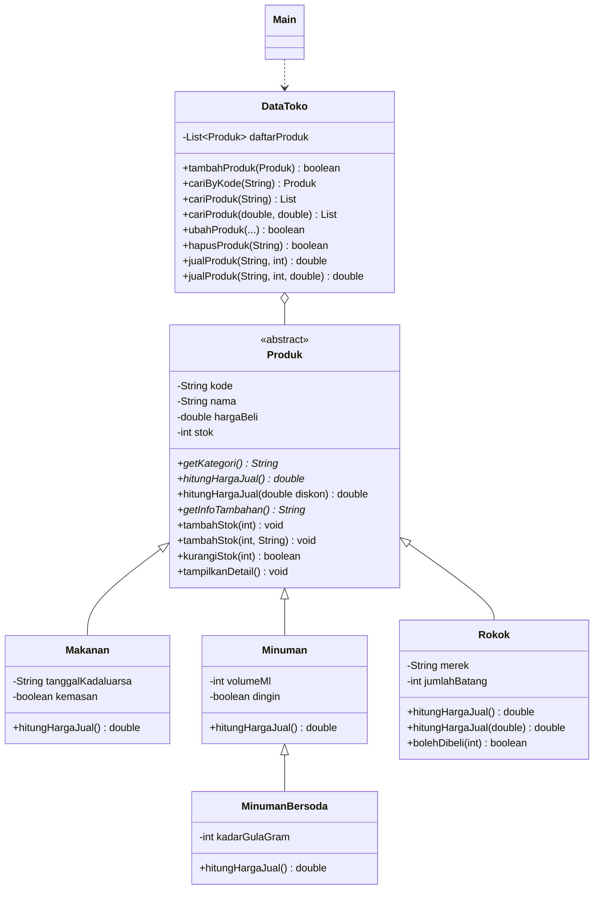

# Sistem Manajemen Toko Madura

Tugas UTS Mata Kuliah **Pemrograman Berorientasi Objek**

| **Nama** Muhammad Risky Alpianur | **NIM** 2509116101 |

---

## 2. Deskripsi Proyek

Toko Madura adalah toko kelontong yang buka 24 jam dan menjual bermacam barang
kebutuhan harian. Pencatatan barang yang masih manual membuat pemilik toko sulit
mengetahui stok yang menipis, harga jual yang seharusnya, serta rekap penjualan.

Program ini dibuat untuk membantu pemilik toko mengelola data barang dagangan.Barang di toko dikelompokkan menjadi empat jenis yang
punya karakteristik dan aturan harga berbeda:

| Jenis | Atribut khusus | Aturan harga jual |
|---|---|---|
| Makanan | tanggal kedaluwarsa, kemasan/curah | harga beli + margin 15% |
| Minuman | volume (ml), dingin/suhu ruang | harga beli + margin 20% + Rp1.000 bila dingin |
| Minuman Bersoda | (turunan Minuman) kadar gula (gram) | harga Minuman + cukai berpemanis Rp500 |
| Rokok | merek, isi per bungkus | harga beli + margin 10% + cukai Rp250/batang, minimal usia pembeli 18 tahun, tidak boleh diskon |

Semua harga jual dibulatkan ke atas ke kelipatan Rp100.

### Fitur Program

1. **Create**: tambah produk baru (Makanan / Minuman / Rokok / Minuman Bersoda).
2. **Read**: tampilkan seluruh produk dalam tabel, lihat detail satu produk, dan cari produk
   berdasarkan **nama/kode** atau berdasarkan **rentang harga**.
3. **Update**: ubah nama, harga beli, stok, serta atribut khusus tiap kategori.
4. **Delete**: hapus produk dengan konfirmasi.
5. **Transaksi penjualan**: keranjang multi-barang, diskon, validasi usia pembeli rokok,
   stok berkurang setelah pembayaran berhasil, dan cetak struk beserta kembalian.
6. **Restock**: tambah stok produk (dengan catatan opsional).
7. **Laporan toko**: jumlah produk per kategori, nilai persediaan, total pendapatan,
   dan daftar produk yang perlu di-restock.

---

## 3. Diagram Kelas & Hierarki Class


---

## 4. Alur Program

### Cara kerja sistem

```
Mulai -> isi data awal (9 produk contoh)
   |
   v
+-> Tampilkan menu -> user memilih angka 0-9
|        |
|        |- 1 Tambah produk  -> pilih kategori -> isi data -> harga jual otomatis
|        |- 2 Daftar produk  -> tabel semua produk
|        |- 3 Detail produk  -> rincian 1 produk (berdasarkan kode)
|        |- 4 Cari produk    -> nama/kode ATAU rentang harga
|        |- 5 Ubah produk    -> ubah nama/harga beli/stok + atribut khusus
|        |- 6 Hapus produk   -> konfirmasi (y/t)
|        |- 7 Transaksi      -> isi keranjang -> hitung total -> bayar -> cetak struk
|        |- 8 Laporan toko   -> ringkasan toko & stok menipis
|        |- 9 Restock        -> tambah stok (catatan opsional)
|        +- 0 Keluar ------------------------------> Selesai
+--------+  (kembali ke menu setelah menekan ENTER)
```

## 5. Penjelasan Bagian Kode

### a. Inheritance (hierarchical): Produk diturunkan ke Makanan, Minuman, Rokok

```java
public abstract class Produk {
    private String kode;
    private String nama;
    private double hargaBeli;
    private int stok;

    public Produk(String kode, String nama, double hargaBeli, int stok) 
    public abstract String getKategori();
    public abstract double hitungHargaJual();
    public abstract String getInfoTambahan();
}
```

Kelas dibuat abstract karena "produk" hanyalah konsep umum; yang benar-benar dijual
selalu berupa makanan, minuman, atau rokok. Sub-class memanggil constructor induk dengan super:

```java
public class Minuman extends Produk {
    public Minuman(String kode, String nama, double hargaBeli, int stok,
                   int volumeMl, boolean dingin) {
        super(kode, nama, hargaBeli, stok); 
        this.volumeMl = volumeMl;      
        this.dingin = dingin;
    }
}
```

### b. Inheritance (multilevel): `Produk` → `Minuman` → `MinumanBersoda`

```java
public class MinumanBersoda extends Minuman {
    public static final double CUKAI_BERPEMANIS = 500;

    @Override
    public double hitungHargaJual() {
        return super.hitungHargaJual() + CUKAI_BERPEMANIS; 
    }
}
```

MinumanBersoda mewarisi semua sifat Minuman (yang sendirinya mewarisi Produk),
lalu menambah atribut kadarGulaGram dan aturan cukai.

### c. Polymorphism: Method Overriding (aturan harga tiap sub-class berbeda)

```java
// Makanan.java
@Override
public double hitungHargaJual() {
    double harga = getHargaBeli() * (1 + MARGIN);       
    return Math.ceil(harga / 100.0) * 100;
}

// Minuman.java
@Override
public double hitungHargaJual() {
    double harga = getHargaBeli() * (1 + MARGIN);       
    if (dingin) {
        harga += BIAYA_PENDINGINAN;               
    }
    return Math.ceil(harga / 100.0) * 100;
}

// Rokok.java
@Override
public double hitungHargaJual() {
    double harga = getHargaBeli() * (1 + MARGIN) + (CUKAI_PER_BATANG * jumlahBatang);
    return Math.ceil(harga / 100.0) * 100;       
}

@Override
public void tampilkanDetail() {
    super.tampilkanDetail();
    System.out.println("  Peringatan      : Dilarang menjual kepada anak di bawah umur!");
}
```

Objek Makanan, Minuman, MinumanBersoda, dan Rokok disimpan dalam satu `List<Produk>`.
Saat `hitungHargaJual()` dipanggil, Java otomatis menjalankan versi milik class aslinya
(*dynamic method dispatch*):

```java
for (Produk p : data) {
    System.out.println(p.toBarisTabel());  
}
```

### d. Polymorphism: Method Overloading (nama sama, parameter berbeda)

```java
// Produk.java
public double hitungHargaJual()                      
public double hitungHargaJual(double diskonPersen)  

public void tambahStok(int jumlah)                 
public void tambahStok(int jumlah, String catatan)  

// DataToko.java
public List<Produk> cariProduk(String kataKunci)               
public List<Produk> cariProduk(double hargaMin, double hargaMax)

public double jualProduk(String kode, int jumlah)                  
public double jualProduk(String kode, int jumlah, double diskonPersen)
```

### e. Condition (if-else)

```java
// Produk.java: status stok
public String getStatusStok() {
    if (stok == 0) return "HABIS";
    if (stok <= 5) return "MENIPIS";
    return "AMAN";
}

// Main.java: validasi usia hanya berlaku untuk Rokok
if (p instanceof Rokok r) {
    if (usia < 0) usia = bacaInt("Usia pembeli   : ");
    if (!r.bolehDibeli(usia)) {
        System.out.println("[!] Ditolak. Pembeli di bawah 18 tahun.");
        lolos = false;
    }
}
```

### f. Looping

```java
// Menu utama berulang sampai user memilih 0
while (jalan) {
    tampilkanMenu();
    ...
}

// Pembeli boleh menambah beberapa barang
do {
    ...
} while (bacaYaTidak("Tambah barang lain? (y/t) : "));

// Menghitung total belanja
for (ItemBelanja item : keranjang) {
    total += item.subtotal();
}
```

---

## 7. Screenshot Program Berjalan & Penjelasannya

**`Menu Utama`**


Menu utama berisi pilihan 0-9. Program berulang (looping `while`) sampai user memilih `0`.

**`Daftar Produk` (Sebelum Tambah Produk)**


Tabel semua produk. Kolom **Harga Jual** berbeda tiap jenis karena tiap sub-class meng-override
`hitungHargaJual()`. Kolom **Status** ditentukan dengan if-else: AMAN, MENIPIS (stok ≤ 5), atau HABIS.

**`Tambah Produk`**


Pengguna memilih kategori, mengisi data, lalu harga jual dihitung otomatis oleh sub-class yang sesuai.

**`Daftar Produk` (Sesudah Tambah Produk)**


Produk baru muncul di tabel.

**`Ubah Produk`**


Data diubah lewat setter (encapsulation). Atribut khusus (kadaluarsa, dingin, isi batang) ditanyakan
sesuai tipe asli objek memakai `instanceof`.

**`Hapus Produk`**


Penghapusan meminta konfirmasi (y/t) terlebih dahulu.

**`Daftar Produk` (Sebelum dihapus Produk)**


**`Daftar Produk` (Sesudah dihapus Produk)**


Produk yang dihapus sudah tidak ada di tabel.

**`Struk & Transaksi`**


Transaksi penjualan: stok berkurang, total dihitung, lalu struk dicetak beserta kembalian.

**`Detail Produk Minuman Bersoda & Rokok`**


**`Cari Produk (Overloading)`**


**`Transaksi Multi-Barang dengan Diskon & Struk`**


**`Rokok Ditolak untuk Pembeli di Bawah Umur`**


**`Laporan Toko`**


